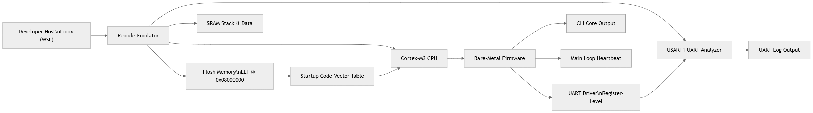
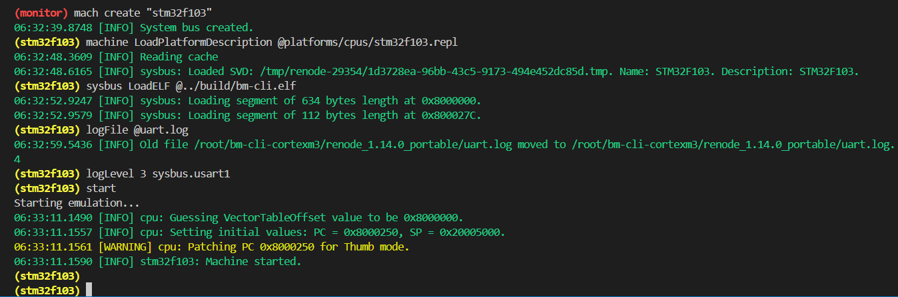
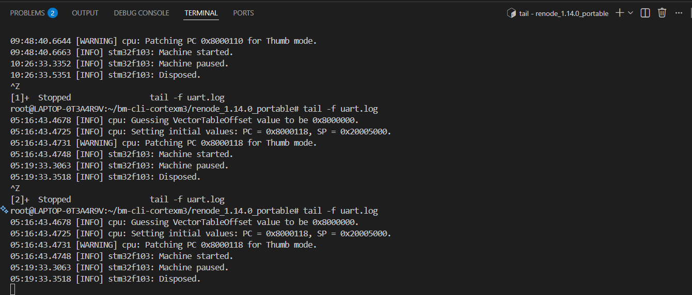
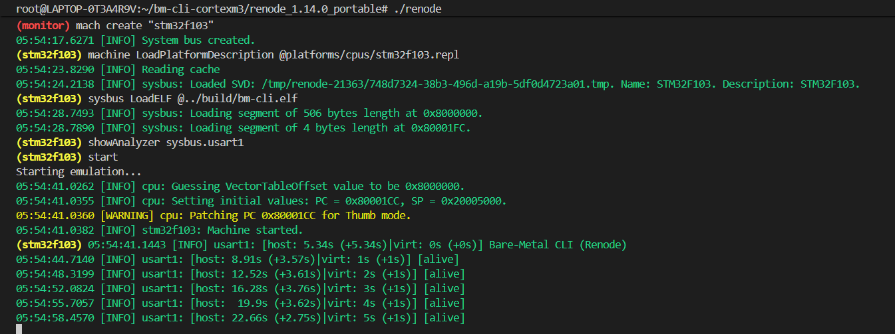
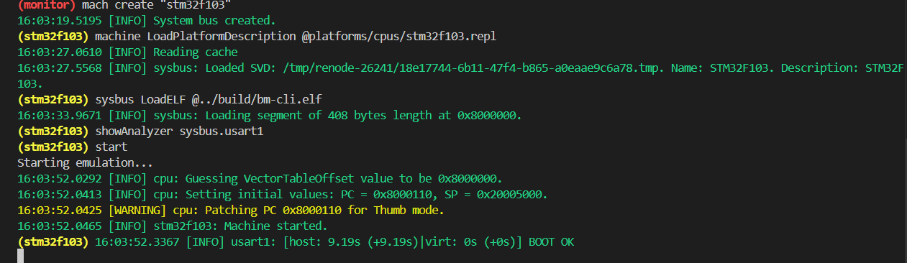

🧠 Bare-Metal CLI on Cortex-M3 (Renode)

  
 
 <b>Minimal bare-metal firmware running on an emulated Cortex-M3 (STM32F103) with UART-based CLI output, built without HAL, RTOS, or OS dependencies.</b> 
 
      

✨ Project Overview

This project demonstrates a true bare-metal firmware running on a Cortex-M3 (STM32F103) microcontroller, emulated using Renode.

The firmware boots from flash, initializes memory manually, configures UART at the register level, and outputs a CLI-style diagnostic interface over USART1.

Here there is no RTOS, no HAL, no CMSIS abstraction, and no operating system — only raw hardware control.

🎯 Aim of the Project

Understand Cortex-M boot flow

Implement startup code & linker control

Build register-level UART drivers

Run firmware in a hardware-accurate emulator

Create a documented, reproducible embedded system

🌍 Real-World Relevance

This project revels how real embedded systems are developed in:

Automotive ECUs

Industrial controllers

Medical devices

Aerospace subsystems

Bootloaders & early-boot diagnostics

Before any OS or RTOS starts, this is the code that runs behind ......

🧱 System Block Diagram

  

Description

The firmware runs on a Cortex-M3 CPU

Flash memory stores the ELF at 0x08000000

SRAM holds stack and runtime data

UART output is captured via Renode USART1 analyzer

🔁 Cortex-M3 Boot Sequence Diagram

  

Boot Flow Explanation

CPU resets

Vector table fetched from flash

Stack pointer initialized from SRAM

Reset_Handler executes

.data and .bss initialized

main() is called

UART is configured

CLI banner is printed

Main loop outputs heartbeat logs

🧩 Firmware Internal Architecture

  

Core Components
Module	Responsibility
startup.s	Reset handler & vector table
linker.ld	Memory layout (Flash / SRAM)
main.c	System entry & main loop
uart.c	Register-level UART driver
cli.c	Output-only CLI core
systick.c	Periodic timing

🖥️ CLI Output (Execution Proof)
🔹 Renode Machine Boot

  

🔹 UART Initialization

  

🔹 CLI Banner

  

🔹 Periodic Heartbeat Logs

  

🔹 Boot Confirmation

  

⚙️ Key Technical Highlights

✔ Bare-metal execution (no OS / RTOS)

✔ Manual vector table & startup code

✔ Custom linker script

✔ Register-level UART configuration

✔ Renode-based emulation (hardware-accurate)

🚀 Applications in Real Systems

This architecture is directly applicable to:

Boot diagnostics firmware

Safety-critical early startup code

Manufacturing test firmware

Secure bootloader foundations

Low-power embedded controllers

Educational CPU / SoC bring-up labs

🧪 Tools & Environment

Language: C, Assembly

Architecture: ARM Cortex-M3

MCU: STM32F103 (emulated)

Emulator: Renode

Build: GCC + Make

Host: Linux / WSL

📌 Project Status

✔ Development complete
✔ Execution verified
✔ Documentation finalized

## 👤 Author

**Siddarth S**  
Electronics & Communication Engineering  
Focus Areas: Bare-Metal Firmware • Embedded Systems • ARM Cortex-M • Low-Level Drivers

> This project was designed, implemented, tested, and documented independently as a deep dive into real-world bare-metal embedded system development.